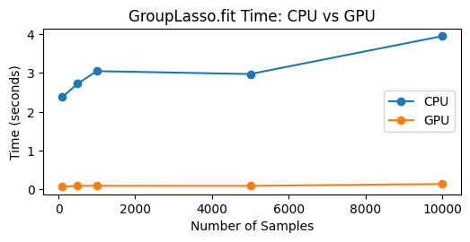

# Group Lasso implemented in PyTorch

## Introduction

This repository implements a Group Lasso algorithm using PyTorch with CUDA support. The model supports group sparsity via a proximal gradient descent approach, along with L1 regularization and adaptive scaling. The implementation ensures efficient computation using TorchScript and automatic mixed precision where available.

## Implementation Details

- **Power Iteration:** Computes the largest eigenvalue of the feature-gram matrix for step size estimation.
- **Group Lasso Proximal Operator:** Applies shrinkage based on pre-defined groups to encourage sparsity.
- **Gradient Descent:** A proximal gradient descent loop is used, including adaptive scaling updates and intercept fitting if enabled.
- **Device Handling:** Automatic conversion of tensors to the selected device (CPU or CUDA) ensures compatibility.
- **Testing:** A comprehensive test suite covers function correctness, device conversion, and proper handling of edge-case inputs.

## Underlying Mathematical Problem

The algorithm employs a proximal gradient descent strategy:
1. **Gradient Step:** Update coefficients by minimizing the differentiable loss function.
2. **Group Proximal Step:** Enforce group sparsity by applying a shrinkage operator on each group.
3. **L1 Proximal Step:** Apply soft-thresholding to promote individual sparsity.
4. **Parameter Updates:** Refresh the intercept and scaling factor after each iteration.

## Benchmark Results

Below is the benchmark comparing CPU and GPU performance. As shown, the GPU demonstrates faster execution in 500 iterations with fit_intercept activated.

*Note: Benchmark run on an NVIDIA T4 GPU.*

## Getting Started

1. Create the environment using `environment.yml`.
2. Run tests with `python -m unittest discover`.

For any questions or contributions, please open an issue or pull request.

